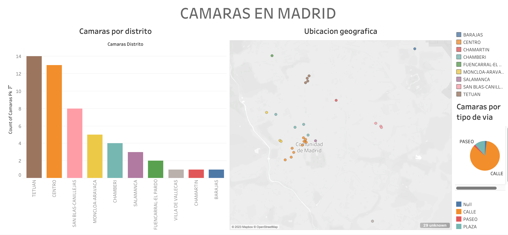

# Accidentes

![imagen accidentes madrid] (./accidentes madrid.png)

## Distrito del hecho

Se pudo observar como claramente hay una gran tasa de hechos en los sectores de Puente de vallecas, Salamanca, Chaartin, Ciudad lineal y Carabanchel y luego se produce un gran decaimiento de los mismos en los distritos registrados y restantes.

## Hora del hecho

Se pudo observar como claramente hay una pronunciacion de los hechos por el horario de la tarde entre las 12:00 hs del mediodia y las 20:00 hs de la tarde noche. Quedando para analisis posteriores concluir el motivo o correlacion de sus causas.

## Tipo de lugar del hecho

Hay una marcada pronunciacion de los hechos sobre los tipos de via 'Calle' y  'Avenida' siendo sus causas, muy comprendibles dado la calidad de obstaculos y variables intervinientes entre todos.

# Camaras que registren hechos con el fin de prevencion

## Cantidad de camaras por distrito

Se observa una notable distincion en los distritos de Tetuan, el centro de Madrid y San Blas de Canilluejas con 14, 13 y 8 camaras respectivamente, decallendo luego de manera pronunciada la cantidad de las mismas en los distritos restantes.

## Tipos de via donde se ditribulle las camarsa

Claramente en todos los distritos hay un muy mayor numero de camaras sobre las calles y sobre las plazas, siendo las restantes casi imperseptibles.