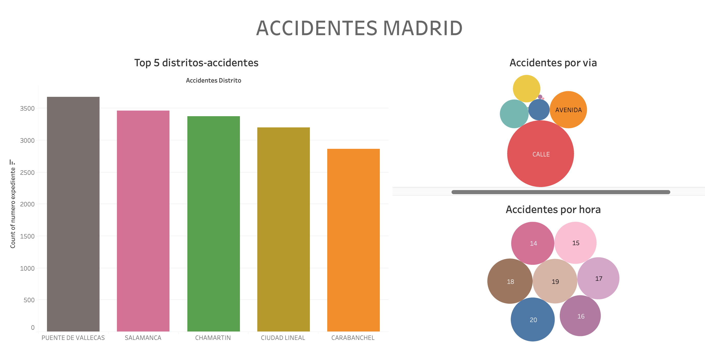
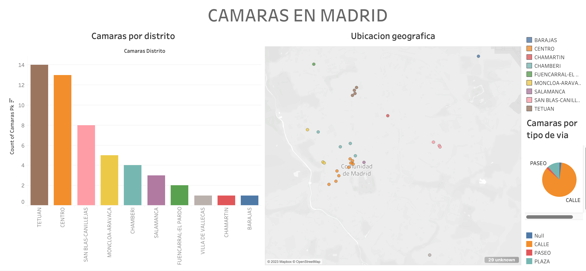

# Accidentes

## Distrito del hecho

Se observa una alta concentración de incidentes en los distritos de Puente de Vallecas, Salamanca, Chamberí, Ciudad Lineal y Carabanchel, seguido de una marcada disminución en los demás distritos.

## Hora del hecho

Los incidentes tienden a ocurrir principalmente en la tarde, entre las 12:00 y las 20:00 horas. Se requiere un análisis adicional para determinar posibles correlaciones y causas.

## Tipo de lugar del hecho

Predominan los incidentes en vías como 'Calle' y 'Avenida', lo cual es comprensible debido a la variedad de obstáculos y factores involucrados.

# Cámaras para prevención

## Cantidad de cámaras por distrito

Se destaca la mayor cantidad de cámaras en los distritos de Tetuán, Centro de Madrid y San Blas-Canillejas, con 14, 13 y 8 cámaras respectivamente, mientras que en los demás distritos la cantidad disminuye considerablemente.

## Distribución de cámaras por tipo de vía

En todos los distritos, las cámaras se distribuyen principalmente en calles y plazas, siendo escasas en otras áreas.
